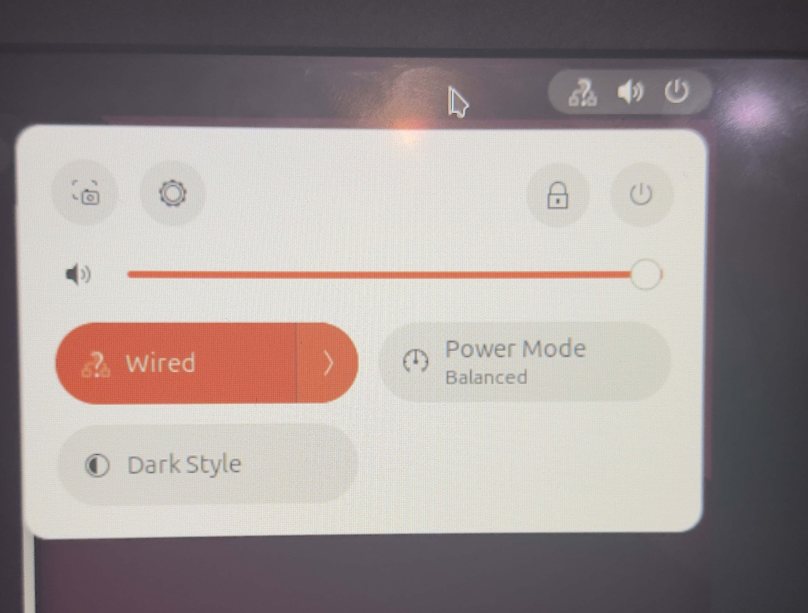
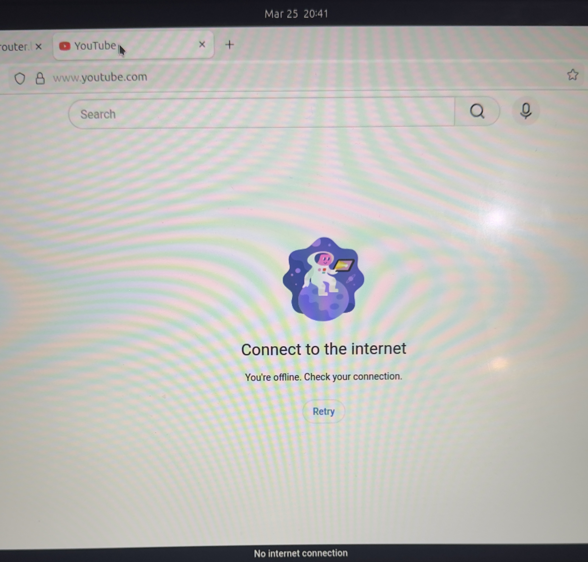
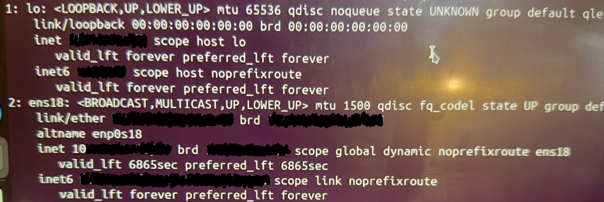
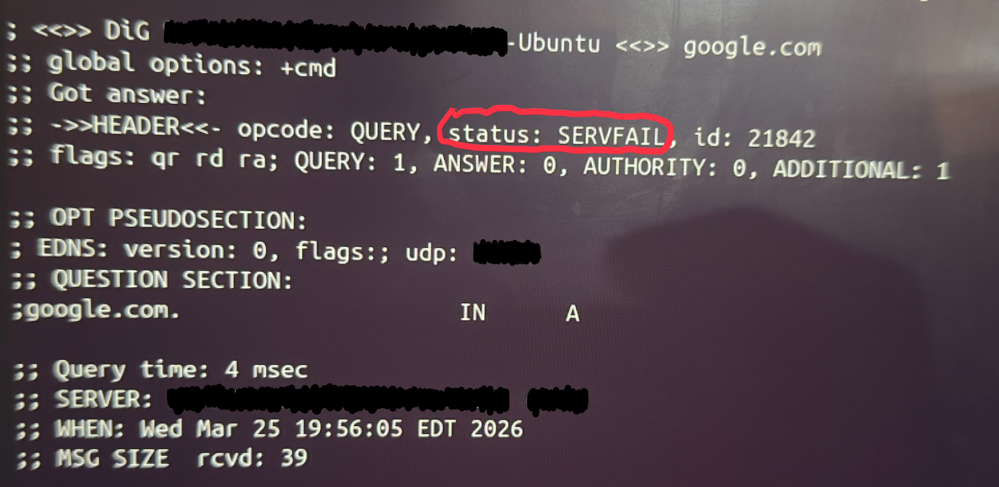
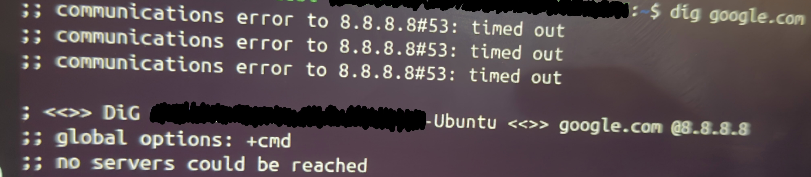
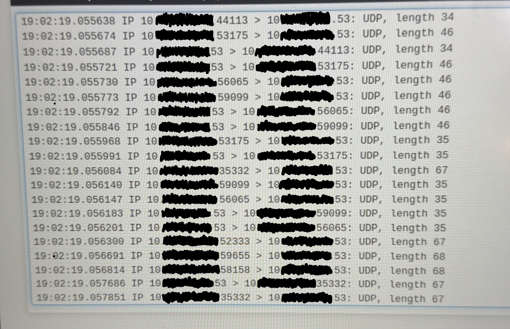
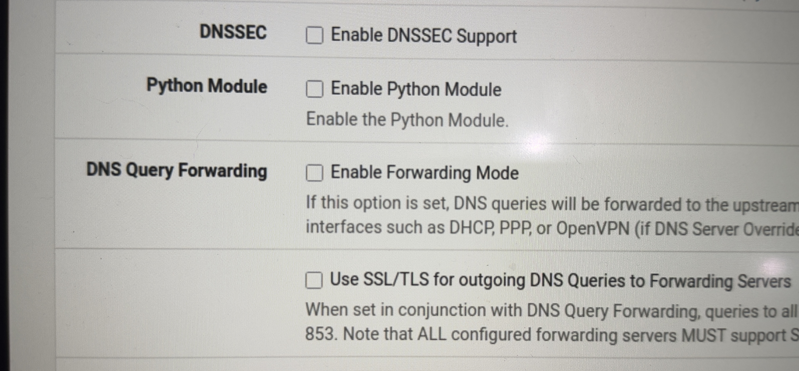
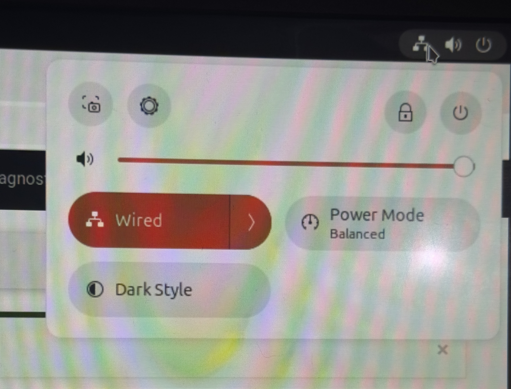

# DNS Resolution Failure in pfSense Lab

## Problem
A client device could reach the internet (ping 8.8.8.8 successful) but failed to resolve domain names (e.g., google.com).

## Hypothesis
The issue is likely DNS-related since:
IP connectivity works, Domain resolution fails

---

## Investigation Steps:

### 1. Verified Network Connectivity
- ping 8.8.8.8 > SUCCESS

Confirms:
  Routing is functional, Internet access exists at Layer 3

### 2. Checked DNS Resolution
- dig google.com > Failed
- dig google.com @8.8.8.8 > Timeout
- dig google.com @router > Failed

Indicates DNS queries are not being resolved properly

### 3. Verified Local DNS Stub
- cat /etc/resolv.conf > 127.X.X.X
- System using local stub resolver (systemd-resolved)

### 4. Packet Capture Analysis
Captured DNS traffic on pfSense interface:

Observed:
  - pfSense responding to DNS queries, No fowarding to upstream DNS servers
  - pfSense acting as resolver but not forwarding requests

### 5. Router-Level Testing
- Ping from pfSense > Success

Confirms: pfSense has outbound connectivity, Not a firewall or WAN issue

---

## Root Cause:

DNS forwarding was *disabled* on pfSense.

As a result:

- pfSense attempted to resolve DNS locally
- No upstream queries were sent
- Clients received failed/empty responses

---

## Solution:

Enabled DNS Forwarding in pfSense:

- Services > DNS Resolver
- Enabled forwarding mode

---

## Key Takeaways:

- Successful ping *DOESN'T EQUAL* working internet
- Always isolate:
  Layer 3 (connectivity), Layer 7 (DNS/application)
- Packet capture is critical for identifying control-plane failures
- Firewall *ISN'T* always the issue

---

## Skills Demonstrated:

- Network troubleshooting methodology
- DNS resolution flow analysis
- Packet capture interpretation
- pfSense configuration debugging

---

## Evidence:

### 1. Initial Failure - No Network Connectivity
The system was unable to access external resources, indicating a potential network or DNS issue.

### 2. Browser Error Confirms Issue
Attempting to access websites resulted in failure, reinforcing that name resolution or outbound connectivity was broken.

### 3. Network Interface Verification
The System's network interface appears correctly configured, ruling out basic interface misconfiguration.

### 4. DNS Query Failure (dig)
Direct DNS queries to Google's DNS server (8.8.8.8) failed, indicating DNS resolution was not functioning properly. ()

### 5. DNS Timeout to Upstream Server
A timeout when querying 8.8.8.8 suggests that DNS requests were not successfully reaching or returning from the upstream server.

### 6. Packet Capture Analysis
Packet capture shows DNS queries being sent but not properly resolved, indicating failure in forwarding or response handling.

### 7. Root Cause - pfSense DNS Forwarding Disabled
Investigation revealed that pfSense was not forwarding DNS queries to upstream servers. DNS forwarding being disabled caused queries to fail despite proper network configuration.

### 8. Network Connectivity Restored
After enabling DNS forwarding on pfSense, DNS resolution and internet access were successfully restored.

### 9. Resolution After Fix
After Correcting the issue, DNS resolution and internet access were restored successfully.

---

## Future Improvements:

- Add diagram of DNS flow
- Simulate additional failure scenarios
- Automate validation checks
